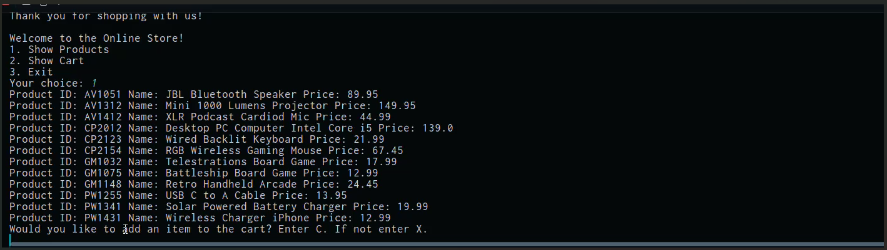

# Online Store

## Description of the Project

This app simulates an online store allowing customers to view products and
search by their ID. Furthermore, it allows them to simulate real life
transactions made at a register. In further detail, the online store uses
a CSV file to load the products into the app. Customers can then add those
products into a cart to purchase. If the purchase is successful it will
display a receipt which includes the purchased products and how much change
is owed.

## User Stories
- As a customer, I want to see a home screen menu, so that I can choose what I want to do in the store.
- As a customer, I want to load products from a CSV file, so that I can see what the store sells.
- As a customer, I want to view all available products, so that I can decide what to buy.
- As a customer, I want to add a product to my cart by entering its ID, so that I can purchase it.
- As a customer, I want to view my cart, so that I can see what I am buying and the total cost.
- As a customer, I want to check out, so that I can pay for my items and receive change.
- As a developer, I want a findProductById method, so that I can reuse product searching in multiple places.

## Setup

Instructions on how to set up and run the project using IntelliJ IDEA.

### Prerequisites

- IntelliJ IDEA: Ensure you have IntelliJ IDEA installed, which you can download from [here](https://www.jetbrains.com/idea/download/).
- Java SDK: Make sure Java SDK is installed and configured in IntelliJ.

### Running the Application in IntelliJ

Follow these steps to get your application running within IntelliJ IDEA:

1. Open IntelliJ IDEA.
2. Select "Open" and navigate to the directory where you cloned or downloaded the project.
3. After the project opens, wait for IntelliJ to index the files and set up the project.
4. Find the main class with the `public static void main(String[] args)` method.
5. Right-click on the file and select 'Run 'YourMainClassName.main()'' to start the application.

## Technologies Used

- Java: Mention the version you are using.
- Any additional libraries or frameworks used in the project.

## Demo
I couldn't get the GIF in a clearer resolution. 

## Future Work

- Customize the console with colors to make the customer experience more enjoyable
- Add a function that lets the customer search by name instead of just ID
- Add the ability for customers to remove an item from the cart
- Add a new CSV file to store and save completed sales transactions

## Resources

List resources such as tutorials, articles, or documentation that helped you during the project.

- [Java Programming Tutorial](https://www.example.com)
- [Effective Java](https://www.example.com)

## Team Members

- **Brandon Roberts** - The developer of this project

## Thanks

Express gratitude towards those who provided help, guidance, or resources:

- Thank you to Potato Sensei for continuous support and guidance.
- A special thanks to all teammates for their dedication and teamwork.
 